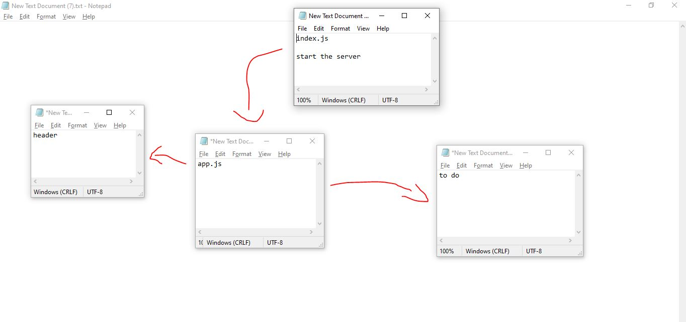

# LAB - Class 32

## Project: Custom Hooks

### Author: Ruwaid al sayyed obeid

### Links and Resources

- [submission PR](https://github.com/ruwaid-401-advanced-javascript/todo/pull/2)
- [Github actions](https://github.com/ruwaid-401-advanced-javascript/resty/pull/2/checks)

## Modules
### index.js
### app.js
### header.js
### todo.js

### Setup

#### How to initialize/run your application 
* `npm start`
* EndPoint: `/` 

#### UML

